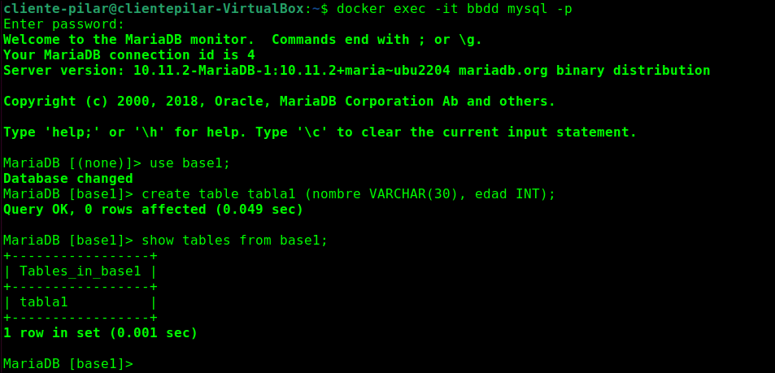

# Ejercicio 1. Trabajo con imágenes

## 1.1 Servidor web

* Arrancamos el contenedor con la instancia de la imagen `php:7.4-apache` con nombre `servidor`y accesible por el puerto **1234**.

  ```bash
  docker run -d --name servidor -p 1234:80 php:7.4-apache
  ```
   

* Comprobamos que el contenedor se ha creado y está funcionando

  ```bash
  docker ps -a -s
  ```


  

* Colocamos en el directorio raíz del servicio web del contenedor un sitio web personalizado

  ```bash
  docker cp TareaDocker servidor:/var/www/html/
  ```

  
  


* Coloca en ese mismo directorio raíz un archivo llamado `cabeceras.php` que muestre todas las cabeceras de la petición HTTP. 


  


```bash
docker cp cabeceras.php servidor:/var/www/html/
```


* Se muestra captura de pantalla después de añadir el sitio web y el script php.

* Borramos el contenedor y comprobamos.

  ```bash
  docker rm -f servidor
  docker ps -a 
  ```


  


## 1.2 Servidor de base de datos

* Nos descargamos una imagen oficial de *`mariadb`* de *Docker Hub*

  ```bash
  docker pull mariadb
  ```


  


* Creamos el contenedor con las especificaciones del enunciado

  ```bash
  docker run -d --name bbdd -e MYSQL_DATABASE=base1 -e MYSQL_ROOT_PASSWORD=root -e MYSQL_USER=daw -e MYSQL_PASSWORD=laboral1 mariadb
  ```


  


* Nos conectamos con el usuario root

  ```bash
  docker exec -it bbdd mysql -p
  ```

* Crea un tabla en la base de datos con el usuario root

  ```sql
  use base1;
  create table tabla1 (nombre VARCHAR(30), edad INT);
  show tables from base1;
  ```


  


 * Comprueba que existe la base de datos desde el usuario daw

   ```bash
   docker exec -it bbdd mysql -u daw -p
   ```

   ```sql
   show databases;
   show tables from base1;
   ```

   

* Comprobamos que no se puede borrar la imagen de `mariadb` mientras está en uso por el contenedor `bbdd`.

  


* Se eliminan los contenedores

  ```bash
  docker rm -f bbdd
  ```


  

## WEBGRAFIA

* Apuntes del aula virtual del módulo DESPLIEGUE DE APLICACIONES WEB
* [Recuperación de cabeceras de protocolo HTTP](https://www.php.net/manual/en/function.getallheaders.php)

