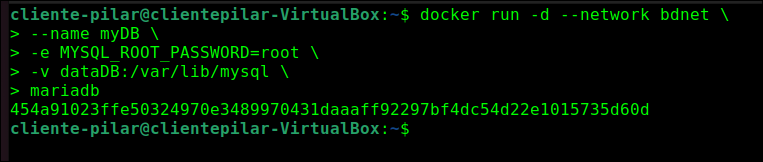
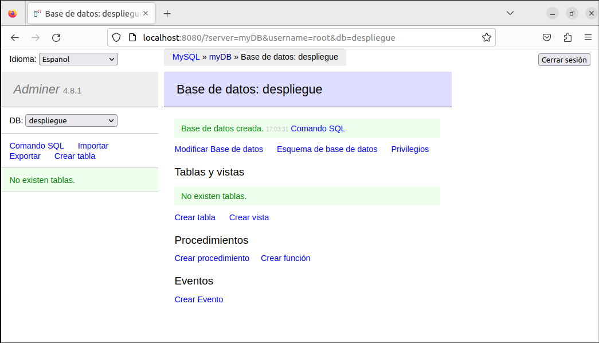

# Ejercicio 2 - Redes y almacenamiento


## Despliegue de contenedores en red: Adminer y MariaDB

* Crea una red bridge `bdnet`

  ```bash
  docker network create bdnet
  docker network ls
  ```

* Creamos un volumen para la base de datos `dataDB`

  ```bash
  docker volume create dataDB
  docker volume ls
  ```

  

* Crea un contenedor con la imagen de `mariadb`con las especificaciones requeridas en el enunciado

  ```bash
  docker run -d --network bdnet --name myDB -e MYSQL_ROOT_PASSWORD=root -v dataDB:/var/lib/mysql mariadb
  ```



* Creamos el contenedor con la imagen del programa Adminer con las especificaciones del enunciado

  ```bash
  docker run -d --network bdnet --name myadminer -p 8080:8080 -e ADMINER_DEFAULT_SERVER=myDB adminer
  ```

  

* Se muestran los dos contenedores creados y funcionando

  ```bash
  docker ps -a
  ```

* Abrimos *Adminer* para conectar con el servidor de la base de datos en el navegador

  

* Crea una base de datos llamada ***despliegue***.

  

* Mostramos los datos generados por el contenedor del servidor de base de datos

  

* Mostramos el borrado de los contenedores, de la red utilizada y del volumen

  ```bash
  docker rm -f $(docker ps -a -q)
  docker ps -a
  docker network prune
  docker network ls
  docker volume prune
  docker volume ls
  ```

  

## WEBGRAFIA

* Apuntes del aula virtual del módulo de DESPLIEGUE DE APLICACIONES WEB

* [Documentación oficial Docker](https://docs.docker.com/reference/)

  

